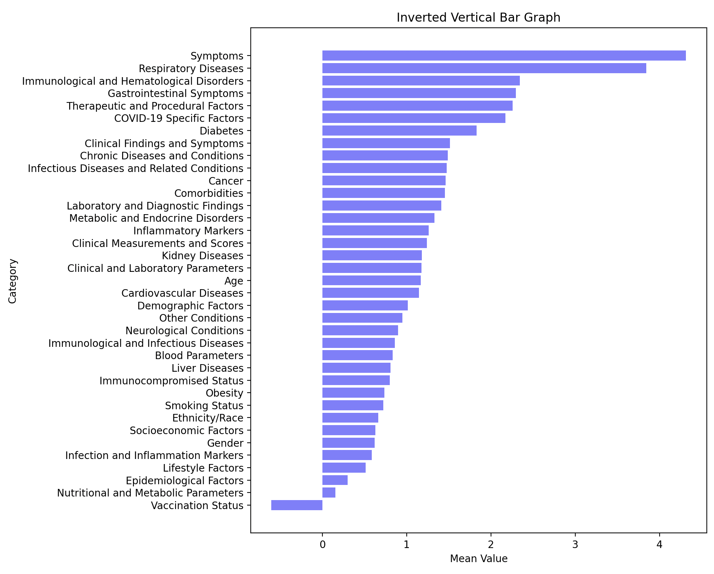

# README

## Overview


This program is designed for the meta-analysis of medical papers, specifically tailored to enhance the efficiency and accuracy of research in the medical field. It operates through a sequence of seven processes, each dedicated to a specific aspect of data handling and analysis. This program is an invaluable tool for researchers, offering a streamlined approach to accessing, analyzing, and visualizing medical literature.

## Installation

-   command "pip install -r requirements.txt" at In the top-level folder(/document_sim_checker).
-   create .env file on the top-level folder, and add ""OPENAI_API_KEY"" of yours.

## Process Flow

The program runs the following seven processes sequentially:

### 1. Check DOI Availability and Fill Empty Abstracts:

-   This process checks the availability of Digital Object Identifiers (DOIs) for each paper.
-   It fills in any missing abstracts in the dataset.

### 2. Embed Papers and Generate Large Index for Semantic Searching:

Papers are embedded using advanced algorithms to facilitate semantic searching.
A large index is generated to optimize search accuracy and speed.

### 3. Semantic Search:

Utilizes the generated index to perform a semantic search.
This process is crucial for finding relevant papers based on the context and meaning of the search query.

### 4. Retrieve Full Body of Papers and Store:

This process fetches the complete content of the papers identified in the semantic search.
Stores the full text for subsequent analysis.

### 5. Paper Body Analysis for Suggesting Evidence:

Analyzes the body of the papers to suggest evidence.
Focuses on extracting and synthesizing key information relevant to the research topic.

### 6. Extract Variables for Meta-Analysis:

This step involves extracting essential variables from the papers for meta-analysis.
It ensures that the data used in the meta-analysis is precise and relevant.

### 7. Visualize Risk Factors Weights:

This final process visualizes the weights of different risk factors identified in the papers.
It aids in understanding the impact and relevance of various risk factors in the research context.

## Accuracy Evaluation Tool

-   eval_searching_indexs_score_with_that_query.py:
    -   This script evaluates the accuracy of the semantic searching system.
    -   It compares the similarity between a key reference document, “COVID-19 Scoring System_Key Articles.rtf”, and the papers retrieved by the program.
    -   This tool is essential for ensuring the reliability and relevance of the search results provided by the program.

## Main Queries

1. Searching query

-   After embedding the title, keywords, and abstract of each article, we use the Faiss module to create an index file (large.index) for searching.
    Compare the cosine similarity between the generated Indexes (vectors) and my query, and collect the k papers with the highest similarity.
    ```
    query = """
    Seeking articles providing statistical analysis (odds ratios, relative risks, hazard ratios) on COVID-19 patient risk factors.
    Focus on: Age, BMI, vaccination status, medication use, vital signs (temperature, chills, shortness of breath, respiratory rate), symptoms (cough, headache, sore throat, voice changes,
    nasal congestion, muscle pain), and comorbidities (diabetes, immune disorders like rheumatism, lung diseases including asthma, COPD, tuberculosis, interstitial lung disease, post-lung
    resection, chronic kidney failure, chronic heart failure, post-solid organ transplant, neurological diseases, cirrhosis of the liver, history of major surgeries like splenectomy).
    """
    ```

    ```

2. Paper Body Analysis for distinguishing paper's value

-   It requires comprehensive data collection and analysis, covering study characteristics, patient demographics, COVID-19 specifics, risk factors, statistical methods, quality assessment, funding, and conflicts of interest.
-   The goal is to determine whether an article is eligible for meta-analysis.

```
  system_message = """
          Suppose you are a competent medical researcher.
          You want to develop an algorithm that can predict whether a person with COVID-19 will become critically ill by investigating the risk factors
           for predicting the progression of the disease to critical illness and the weight of each risk factor.
          Read the documentation I have provided, and fill in the empty values in the following json template.
          If it appears that there is no information for that key, put "None" for value.
          To answer the question, your response must reflect all the necessary information from the paper.
          An answer consisting of a few short sentences should be assigned to value.
          You should only return a json template with the value filled in. You should not return any other text.
          Think step by step and fill in the values one by one.
          """
```

```
          resp_format = """
              {
                  "Study_Characteristics": {
                      "Study_Design": "Type of research study",
                      "Study_Period": "Time frame of the study",
                      "Location_of_the_Study": "Geographic location",
                      "Sample_Size": "Number of participants"
                  },
                  "Participant_Demographics": {
                      "Age_Distribution": "Age range and average",
                      "Gender_Distribution": "Breakdown by gender",
                      "Ethnicity": "Ethnic backgrounds",
                      "Pre-existing_Health_Conditions": "Existing medical conditions",
                      "Socioeconomic_Status": "Economic and social position"
                  },
                  "COVID-19_Specific_Information": {
                      "Criteria_for_COVID-19_Diagnosis": "Diagnosis methods",
                      "Severity_Classification_Method": "How severity is defined",
                      "Duration_of_Illness_before_Hospital_Admission": "Time to hospitalization",
                      "Symptoms_Presented": "Reported symptoms"
                  },
                  "Risk_Factor_Data": {
                      "Comorbidities": "Other medical conditions",
                      "Lifestyle_Factors": "Behaviors like smoking, diet",
                      "Immunization_Status": "Vaccination status",
                      "Previous_Infections_or_Co-infections": "History of other infections"
                  },
                  "Statistical_Analysis": {
                      "Statistical_Methods_Used": "Techniques for data analysis",
                      "Outcome_Variables_Measured": "Specific outcomes measured",
                      "Adjustments_for_Confounders": "Handling of confounders",
                      "Results_of_the_Analyses": "Key findings and statistics"
                  },
                  "Quality_Assessment": {
                      "Risk_of_Bias_in_the_Study": "Evaluation of potential bias",
                      "Methodological_Quality": "Study’s methodology assessment"
                  },
                  "Funding_and_Conflicts_of_Interest": {
                      "Funding_Sources": "Who funded the study",
                      "Declarations_of_Potential_Conflicts_of_Interest": "Potential biases"
                  },
                  "Supplementary_Information": {
                      "Supplementary_Data_or_Material": "Additional data provided",
                      "Correspondence_Information_for_Lead_Authors": "Contact information"
                  }
              }
          """
```

3. Extract Variables for Meta-Analysis

-   Query to collect the mean and std of the odds ratio by variable after body search.
-   I used "function_call", chatgpt's supporting system, for gathering data with fixed format.

```
  syetem_message = """
  Let's say you're a competent researcher.
  You have been asked to read a document I provide and fill in whether the information in the sentence below exists and, if so, at what value it is defined in the paper.
  You must extract all the information you need to answer. Follow the response form I provide, and don't leave anything out.
  Think step by step.

  and here is The paper.
  """
```

```
  schema = {
  "type": "object",
  "properties": {
      "Predictor_Variables": {
          "type": "object",
          "description": "Specific to COVID-19 severity with a list of variables.",
          "properties": {
              "Specific_to_COVID_19_Severity": {
                  "type": "string",
                  "description": "Indicates whether the predictor variables are specifically relevant to COVID-19 severity (Yes/No)"
              },
              "Detailed_Variables": {
                  "type": "array",
                  "description": "List of Variables (risk factors) with OR and 95% CI score.",
                  "items": {
                      "type": "object",
                      "properties": {
                              "Variable": {
                                  "type": "string",
                                  "description": "Risk Factors for estimating COVID-19 severity. for example, Age, BMI, vaccination status, medication use, temperature, chills, shortness of breath, respiratory rate, cough, headache, sore throat, voice changes, nasal congestion, muscle pain, diabetes, rheumatism, asthma, COPD, tuberculosis, interstitial lung disease, post-lung resection, chronic kidney failure, chronic heart failure, post-solid organ transplant, neurological diseases, cirrhosis of the liver, splenectomy, etc.  "
                              },
                              "Odds_Ratio_OR": {
                                  "type": "string",
                                  "description": "Odds Ratio (OR)"
                              },
                              "OR_95%_Confidence_Interval": {
                                  "type": "string",
                                  "description": "95% Confidence Interval"
                              },
                              "Relative Risk_RR": {
                                  "type": "string",
                                  "description": "Relative Risk (RR)"
                              },
                              "RR_95%_Confidence_Interval": {
                                  "type": "string",
                                  "description": "95% Confidence Interval"
                              },
                              "Hazard_Ratio_HR": {
                                  "type": "string",
                                  "description": "Hazard Ratio (HR)"
                              },
                              "HR_95%_Confidence_Interval": {
                                  "type": "string",
                                  "description": "95% Confidence Interval"
                              },
                          }
                      }
                  }
          },
          "required": ["Specific_to_COVID_19_Severity", "Detailed_Variables"]
      },
      "Statistical_Measures_of_Association": {
          "type": "object",
          "description": "Traditional metrics like ORs, HRs, RRs, and confidence intervals.",
          "properties": {
              "Odds_Ratios_OR": {
                  "type": "string",
                  "description": "Presence of Odds Ratios (OR) (Present/Absent)"
              },
              "Hazard_Ratios_HR": {
                  "type": "string",
                  "description": "Presence of Hazard Ratios (HR) (Present/Absent)"
              },
              "Relative_Risks_RRs": {
                  "type": "string",
                  "description": "Presence of Relative Risks (RRs) (Present/Absent)"
              },
              "Confidence_Intervals": {
                  "type": "string",
                  "description": "Presence of Confidence Intervals (Present/Absent)"
              }
          },
          "required": ["Odds_Ratios_OR", "Hazard_Ratios_HR", "Relative_Risks_RRs", "Confidence_Intervals"]
      },
      "Meta_Analysis_Specific_Metrics": {
          "type": "object",
          "description": "Metrics specific to meta-analyses like heterogeneity assessment, sensitivity analysis, cumulative sample size, and subgroup analysis.",
          "properties": {
              "Heterogeneity_Assessment": {
                  "type": "string",
                  "description": "Type of Heterogeneity Assessment used (I² Statistic, Cochran’s Q Test, etc.)"
              },
              "Sensitivity_Analysis": {
                  "type": "string",
                  "description": "Whether Sensitivity Analysis was conducted (Conducted/Not Conducted)"
              },
              "Cumulative_Sample_Size": {
                  "type": "string",
                  "description": "Status of reporting Cumulative Sample Size (Reported/Not Reported)"
              },
              "Subgroup_Analysis": {
                  "type": "string",
                  "description": "Presence of Subgroup Analysis (Present/Absent)"
              }
          },
          "required": ["Heterogeneity_Assessment", "Sensitivity_Analysis", "Cumulative_Sample_Size", "Subgroup_Analysis"]
      },
      "Study_Quality_Assessment": {
          "type": "object",
          "description": "Evaluating the quality of included studies and risk of bias.",
          "properties": {
              "Quality_of_Included_Studies": {
                  "type": "string",
                  "description": "Assesses the overall quality and reliability of the studies included in the meta-analysis."
              },
              "Risk_of_Bias": {
                  "type": "string",
                  "description": "Evaluates if the meta-analysis examines potential biases in the included studies."
              }
          },
          "required": ["Quality_of_Included_Studies", "Risk_of_Bias"]
      },
      "P-Values": {
          "type": "object",
          "description": " Reporting on specific variables and significance thresholds.",
          "properties": {
              "Specific_Variables": {
                  "type": "array",
                  "description": "List of risk factors with P < threshold_for_Significance, including P-value.",
                  "items": {
                      "type": "object",
                      "properties": {
                          "Variable": {
                              "type": "string",
                              "description": "Name of the variable"
                          },
                          "P_Value": {
                              "type": "string",
                              "description": "P-value"
                          }
                      }
                  }
              },
              "Threshold_for_Significance": {
                  "type": "string",
                  "description": "The threshold level for significance (e.g., P < 0.05)"
              }
          },
          "required": ["Specific_Variables", "Threshold_for_Significance"]
      },
      "Publication_Bias": {
          "type": "object",
          "description": "Assessment through funnel plot analysis or other methods.",
          "properties": {
              "Funnel_Plot_Analysis": {
                  "type": "string",
                  "description": "Indicates if Funnel Plot Analysis was conducted (Conducted/Not Conducted)"
              },
              "Other_Methods": {
                  "type": "string",
                  "description": "List of other methods used for assessing publication bias"
              }
          },
          "required": ["Funnel_Plot_Analysis", "Other_Methods"]
      },
      "Sample_Size": {
          "type": "string",
          "description": "Reporting on the cumulative sample size in the meta-analysis."
      },
      "Generalizability": {
          "type": "string",
          "description": "Evaluating the applicability of the findings to a wider population."
      },
      "Additional_Considerations": {
          "type": "object",
          "description": "Assessing the specificity to the research question, consistency of methods across studies, and appropriateness of statistical methods.",
          "properties": {
              "Specificity_to_Research_Question": {
                  "type": "string",
                  "description": "Checks whether the studies directly address the research question. (Yes/No)"
              },
              "Consistency_of_Methods_Across_Studies": {
                  "type": "string",
                  "description": "Evaluates if the statistical methods used are suitable for the type of data and research question. (Yes/No)"
              },
              "Appropriateness_of_Statistical_Methods": {
                  "type": "string",
                  "description": "Evaluates if the statistical methods used are suitable for the type of data and research question. (Yes/No)"
              }
          },
          "required": ["Specificity_to_Research_Question", "Consistency_of_Methods_Across_Studies", "Appropriateness_of_Statistical_Methods"]
      }
      },
  "required": ["Predictor_Variables", "Statistical_Measures_of_Association", "Meta_Analysis_Specific_Metrics", "Study_Quality_Assessment", "P-Values", "Publication_Bias", "Sample_Size", "Generalizability", "Additional_Considerations"]
}
```

## User Guide

-   Ensure all dependencies are installed.
-   Run each process sequentially, as they build upon each other.
-   Use the evaluation tool to check the accuracy of the semantic search.
